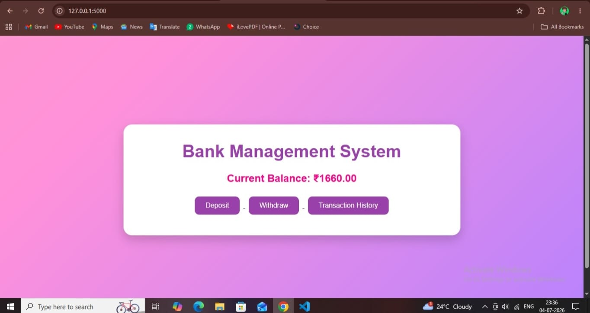
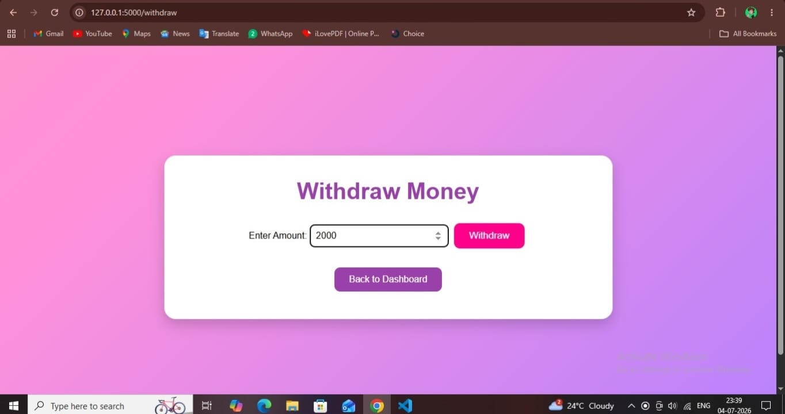
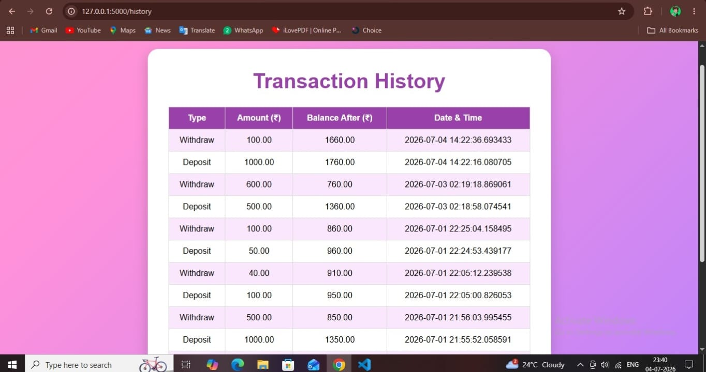
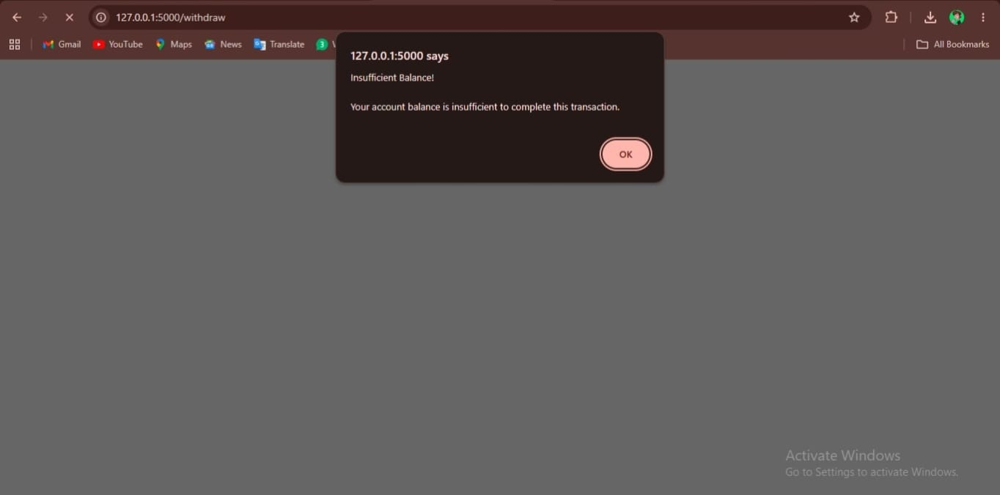

# 🏦 Bank Management System

This is a simple Bank Management System developed using **Python, Flask, HTML, CSS, and PostgreSQL**.

It allows users to perform basic banking operations through a web interface while storing data in a PostgreSQL database.

## ✨ Features

- 💰 View current account balance
- ➕ Deposit money
- ➖ Withdraw money
- 📜 View transaction history
- ⚠️ Error handling for:
  - Insufficient balance
  - Invalid amount (zero or negative)

## 🛠️ Technologies Used

- Python
- Flask
- PostgreSQL
- HTML
- CSS

## 📂 Project Structure

```
Bank-management-system/
│
├── app.py
├── database.py
├── requirements.txt
├── README.md
│
├── static/
│   └── style.css
│
└── templates/
    ├── dashboard.html
    ├── deposit.html
    ├── withdraw.html
    └── history.html
```

## 🚀 How to Run

1. Clone this repository.
2. Install the required packages.

```bash
pip install -r requirements.txt
```

3. Create the required PostgreSQL database and tables.
4. Update the database connection details in `database.py`.
5. Run the application.

```bash
python app.py
```

6. Open your browser and visit:

```
http://127.0.0.1:5000/
```

## 📚 What I Learned

Through this project, I learned:

- Building web applications using Flask
- Connecting Flask with PostgreSQL
- Using SQL queries for database operations
- Creating multiple web pages using HTML templates
- Styling web pages using CSS
- Handling user input and basic validation
- Implementing simple error handling

## 👩‍💻 Author

**Kirti Gadhave**

B.Sc. Computer Science Student
## 📸 Project Screenshots

### 🏠 Dashboard


---

### 💰 Deposit Page


---

### 💸 Withdraw Page


---

### 📜 Transaction History


---

### ⚠️ Insufficient Balance
